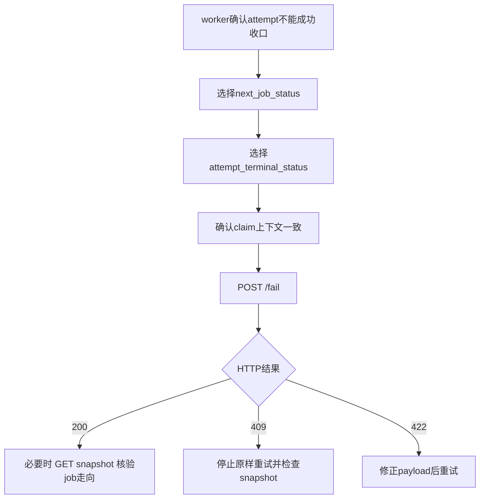

# Runtime terminal caller integration guide v1

## 1. 文档定位

本文档面向 **runtime terminal 的直接调用方**，包括：
- worker runtime reporter
- job executor / orchestrator
- 上层任务编排服务
- 负责封装 terminal SDK / adapter 的接入开发者

它的目标不是重写实现细节，而是回答调用方最关心的 6 件事：

1. 什么场景该调 `POST /complete`
2. 什么场景该调 `POST /fail`
3. 调用前必须准备哪些身份字段
4. 成功、409、422、404 各自意味着什么
5. 调用后如何用 `GET /jobs/{job_id}` 做结果核验
6. 哪些错误可以重试，哪些不要直接重试

本文档与以下材料配套：
- `runtime_terminal_api_contract_pack_v1.md`
- `runtime_terminal_orchestration_explainer_v1.md`
- `runtime_terminal_operator_troubleshooting_matrix_v1.md`
- `runtime_terminal_self_check_pack_v2.md`

本文档严格遵守当前 v1 冻结边界：
- 不改变 complete / fail 写侧语义
- facade 写侧不绕过 service 直写 repository
- 不触碰冻结测试 `tests/test_runtime_terminal_workflow.py`
- 422 继续保持 FastAPI / Pydantic 默认行为

---

## 2. 先给调用方的总规则

把 runtime terminal v1 当成一个 **终态回写接口**，而不是调度接口。

调用方要记住：
- `POST /complete`：表示“这次 attempt 已成功收口”
- `POST /fail`：表示“这次 attempt 已失败类收口”
- `GET /jobs/{job_id}`：表示“读取当前 terminal 快照做核验/排障”

它们不负责：
- claim
- heartbeat
- 派发 worker
- 重试调度
- 历史终态修正

一句话：
- **terminal 接口负责回写结果，不负责决定谁来跑、何时重跑、如何抢占。**

---

## 3. API surface 速查

Base prefix:

```text
/api/v1/runtime/terminal
```

3 个 endpoint：

```text
POST /api/v1/runtime/terminal/complete
POST /api/v1/runtime/terminal/fail
GET  /api/v1/runtime/terminal/jobs/{job_id}
```

推荐理解方式：
- complete / fail：写终态
- GET snapshot：读终态

---

## 4. 调用方最重要的 4 个身份字段

无论调用 complete 还是 fail，**最重要的是这 4 个字段必须来自同一次真实 attempt 上下文**：

- `job_id`
- `attempt_id`
- `worker_id`
- `claim_token`

这是调用方最常见的错误源。

### 4.1 `job_id`
标识 runtime job 主体。

### 4.2 `attempt_id`
标识当前这一轮执行尝试。

### 4.3 `worker_id`
标识当前执行该 attempt 的 worker。

### 4.4 `claim_token`
标识当前活跃 lease / claim 归属，是并发校验关键字段。

### 4.5 调用方必须保证的约束

以下情况极易触发 409：
- 用旧 `claim_token` 回写新 attempt
- 用 A worker 的 `worker_id` 回写 B worker 持有的 attempt
- 从缓存中取到了过期 `attempt_id`
- job 已 terminal 后又重复提交 complete / fail

推荐接入原则：
- 不要在 terminal 写入前“重新猜测”这 4 个字段
- 不要从多个来源拼装它们
- 最好把它们作为同一执行上下文的一部分原样透传

---

## 5. 什么时候调用 complete，什么时候调用 fail

## 5.1 该调用 `POST /complete` 的场景

只有在以下条件同时满足时再调：
- 本次 attempt 已实际成功完成
- 调用方仍确认自己持有匹配的 `worker_id + claim_token`
- 成功结果引用已经确定
- 不再需要把该 attempt 维持在运行态

典型例子：
- 视频生成成功，产物已上传，`result_ref` 已确定
- manifest 已生成，`manifest_artifact_id` 已确定或可为空
- 耗时信息已统计完成

不应调用 complete 的场景：
- 只是“快成功了”，但最终产物还没落定
- 不确定 lease 是否仍有效
- 不确定自己拿到的是不是当前最新 attempt

## 5.2 该调用 `POST /fail` 的场景

只有在以下条件同时满足时再调：
- 本次 attempt 已确认不能按成功路径收口
- 调用方已经选定 `next_job_status`
- 调用方已经选定 `attempt_terminal_status`
- `job_id + attempt_id + worker_id + claim_token` 确认匹配

典型例子：
- provider 明确失败，且 job 不应再继续 -> `FAILED`
- 本次 attempt 超时，但 job 允许重试 -> `WAITING_RETRY` + `TIMED_OUT`
- 任务已陈旧/失效，不再继续 -> `STALE`

不应调用 fail 的场景：
- 只是暂时网络抖动，还可能继续成功
- 尚未决定 job 是 `FAILED` 还是 `WAITING_RETRY`
- 想用 fail 去覆盖已经写成功的历史终态

---

## 6. `POST /complete` 接入说明

## 6.1 关键请求字段

`CompleteJobRequest` 关键字段：
- `job_id`
- `attempt_id`
- `worker_id`
- `claim_token`
- `completion_status`
- `terminal_reason`
- `result_ref`
- `manifest_artifact_id`
- `runtime_ms`
- `provider_runtime_ms`
- `upload_ms`
- `metadata_json`

补充理解：
- `completion_status`：attempt 成功完成时的补充标签，不等于 `job_status`
- `result_ref`：最重要的成功产物引用
- `manifest_artifact_id`：manifest 类产物标识，兼容 `UUID | str | None`
- `runtime_ms / provider_runtime_ms / upload_ms`：用于后续排障和耗时归因

## 6.2 推荐最小 payload 模式

```json
{
  "job_id": "job-123",
  "attempt_id": "attempt-5",
  "worker_id": "worker-a",
  "claim_token": "claim-xyz",
  "completion_status": "SUCCEEDED",
  "result_ref": "minio://bucket/path/output.mp4",
  "manifest_artifact_id": "manifest-123",
  "runtime_ms": 31000,
  "provider_runtime_ms": 27000,
  "upload_ms": 1800,
  "metadata_json": {
    "source": "veo_pipeline",
    "creative_id": "creative-88"
  }
}
```

## 6.3 成功返回后调用方应如何理解

成功返回 200 后，调用方应预期：
- attempt 已被写成 completed / succeeded 类终态
- job 已成功收口
- lease 已释放
- worker current job count 已做对应更新

但调用方不要只凭主观猜测，应在必要时再读一次 snapshot 核验。

## 6.4 调用 complete 后建议做的核验

推荐调用：

```text
GET /api/v1/runtime/terminal/jobs/{job_id}
```

优先看：
- `job_status`
- `finished_at`
- `latest_attempt.attempt_status`
- `latest_attempt.completion_status`
- `latest_attempt.result_ref`
- `latest_attempt.manifest_artifact_id`
- `active_lease`

常见误区：
- `completion_status` 不等于 `job_status`
- `active_lease = null` 往往是正常释放结果，不是异常

---

## 7. `POST /fail` 接入说明

## 7.1 关键请求字段

`FailJobRequest` 关键字段：
- `job_id`
- `attempt_id`
- `worker_id`
- `claim_token`
- `next_job_status`
- `attempt_terminal_status`
- `terminal_reason`
- `error_code`
- `error_message`
- `error_payload_json`
- `expire_lease`
- `metadata_json`

## 7.2 允许值边界

### `next_job_status` 仅允许
- `FAILED`
- `WAITING_RETRY`
- `STALE`

### `attempt_terminal_status` 仅允许
- `FAILED`
- `TIMED_OUT`
- `STALE`

调用方要特别注意：
- job 走向由 `next_job_status` 决定
- attempt 终态由 `attempt_terminal_status` 决定
- 两者不是同一个维度

## 7.3 推荐决策表

| 场景 | next_job_status | attempt_terminal_status | 说明 |
|---|---|---|---|
| 本次 attempt 失败，job 不再继续 | `FAILED` | `FAILED` | 直接失败收口 |
| 本次 attempt 超时，但 job 可重试 | `WAITING_RETRY` | `TIMED_OUT` | 最常见的超时重试组合 |
| 当前 attempt 已陈旧，job 也不再继续 | `STALE` | `STALE` | stale 终态组合 |
| 本次 attempt 执行失败，但上层决定稍后重试 | `WAITING_RETRY` | `FAILED` | 失败但保留 job 重试机会 |

## 7.4 `error_payload_json` 的重要边界

- 它是 `dict`，默认空
- **不能显式传 `null`**
- 如果调用方想表达“未提供 payload，让系统沿用既有值语义”，应**省略字段**，不能传 `null`

推荐：
- 需要传补充失败上下文时，传对象
- 不需要时，直接省略或传空对象

错误示例：

```json
{
  "error_payload_json": null
}
```

## 7.5 `expire_lease` 怎么理解

- `expire_lease=true`：按“过期”语义处理 lease
- `expire_lease=false`：按“正常 release”语义处理 lease

它们不是同一件事。

调用方应基于业务语义选择，而不是随手固定写死。

## 7.6 推荐最小 payload 模式

```json
{
  "job_id": "job-123",
  "attempt_id": "attempt-5",
  "worker_id": "worker-a",
  "claim_token": "claim-xyz",
  "next_job_status": "WAITING_RETRY",
  "attempt_terminal_status": "TIMED_OUT",
  "terminal_reason": "provider timeout",
  "error_code": "PROVIDER_TIMEOUT",
  "error_message": "provider call exceeded timeout budget",
  "error_payload_json": {
    "provider": "veo",
    "timeout_s": 120
  },
  "expire_lease": true,
  "metadata_json": {
    "source": "veo_pipeline"
  }
}
```

## 7.7 调用 fail 后建议做的核验

优先看 snapshot 中：
- `job_status`
- `terminal_reason_code`
- `terminal_reason_message`
- `latest_attempt.attempt_status`
- `latest_attempt.error_code`
- `latest_attempt.error_message`
- `latest_attempt.error_payload_json`
- `active_lease`

常见误区：
- `attempt_terminal_status=TIMED_OUT` 不自动等于 job 一定 `FAILED`
- `job_status` 看的是 `next_job_status` 结果

---

## 8. 返回结果该怎么处理

## 8.1 200 success

说明 terminal 写入已按当前 contract 成功处理。

调用方建议：
- 记录 response 中的 `job_id / attempt_id / lease_id / job_status / attempt_status`
- 如下游还要做状态对账，追加一次 `GET /jobs/{job_id}`
- 不要在 200 后立刻再次补发同一 terminal 请求

## 8.2 409 `runtime_lease_conflict`

说明更像是 **调用上下文不一致**，而不是 payload 结构问题。

优先怀疑：
- `worker_id` 不匹配
- `claim_token` 不匹配
- 当前 attempt 已不属于这个 writer
- lease 已切换、释放或过期

调用方动作：
1. 停止原样重试
2. 读取 `GET /jobs/{job_id}`
3. 核对 `active_lease.worker_id` / `active_lease.claim_token`
4. 核对 `latest_attempt.attempt_id` / `latest_attempt.worker_id`

**不要把 lease conflict 当成短暂网络错误无脑重试。**

## 8.3 409 `runtime_state_conflict`

说明更像是 **状态已终态化或重复提交**。

优先怀疑：
- job 已 terminal
- 同一 attempt 已写过 terminal
- 上一次请求其实已经成功
- 调用方重放了旧消息

调用方动作：
1. 不要先重发同一请求
2. 读取 snapshot
3. 重点看 `job_status`、`finished_at`、`latest_attempt.attempt_status`
4. 先判断是否已经实际收口

## 8.4 422 validation error

说明请求模型本身非法。

最常见原因：
- 字段缺失
- 字段类型错误
- `next_job_status` 非允许值
- `attempt_terminal_status` 非允许值
- 显式传了 `error_payload_json=null`

调用方动作：
- 直接修 payload
- 不必先怀疑 runtime terminal 服务状态
- 422 继续按 FastAPI / Pydantic 默认结构读取

## 8.5 404 `runtime_job_not_found`

当前只应主要出现在：
- `GET /jobs/{job_id}`

调用方动作：
- 先核对 `job_id`
- 确认访问的环境/库实例没错
- 确认该 job 确实存在于当前 runtime 环境

---

## 9. 推荐调用流程

## 9.1 success path

```mermaid
flowchart TD
    A[worker完成attempt] --> B[确认job_id attempt_id worker_id claim_token一致]
    B --> C[确认结果引用与耗时信息已准备好]
    C --> D[POST /complete]
    D --> E{HTTP结果}
    E -->|200| F[必要时 GET /jobs/{job_id} 核验]
    E -->|409| G[停止重试并读取snapshot排障]
    E -->|422| H[修payload后重试]
```

## 9.2 fail path



---

## 10. Snapshot 核验指南

调用 complete / fail 后，如需二次确认，统一读取：

```text
GET /api/v1/runtime/terminal/jobs/{job_id}
```

建议按三层看：

## 10.1 job 层
优先看：
- `job_status`
- `claimed_by_worker_id`
- `active_claim_token`
- `attempt_count`
- `finished_at`
- `lease_expires_at`
- `terminal_reason_code`
- `terminal_reason_message`

## 10.2 latest attempt 层
优先看：
- `attempt_id`
- `attempt_status`
- `worker_id`
- `claim_token`
- `completion_status`
- `error_code`
- `error_message`
- `error_payload_json`
- `result_ref`
- `manifest_artifact_id`
- `runtime_ms`
- `provider_runtime_ms`
- `upload_ms`

## 10.3 active lease 层
优先看：
- `lease_id`
- `lease_status`
- `worker_id`
- `claim_token`
- `lease_expires_at`
- `last_heartbeat_at`
- `revoked_at`
- `revoked_reason`

调用方的最小判断原则：
- 先确认自己看的确实是同一个 `job_id`
- 先确认 `latest_attempt` 是否就是自己这次回写对应的 attempt
- 先确认 `active_lease` 是否还存在，再判断 lease 是否异常

---

## 11. 调用方常见误区

## 11.1 误把 `completion_status` 当成 job 最终状态

不是。
- `completion_status` 是 attempt 成功信息补充字段
- `job_status` 才是 job 层状态

## 11.2 误把 `attempt_terminal_status` 当成 job 下一步走向

不是。
- attempt 终态看 `attempt_terminal_status`
- job 走向看 `next_job_status`

## 11.3 误把 409 当成瞬时网络错误无脑重试

不对。
- `runtime_lease_conflict` 往往是 claim 上下文错了
- `runtime_state_conflict` 往往是已 terminal 或重复提交

## 11.4 误把 `active_lease = null` 当成异常

不对。
- complete 成功后 lease 正常释放，`active_lease` 可能本来就应为空

## 11.5 误把 422 当成 terminal 业务冲突

不对。
- 422 优先说明 payload 不合法
- 先修请求，再谈业务语义

## 11.6 失败时不区分“对人说明”和“对机分类”

推荐分工：
- `error_code`：机器可读分类
- `error_message`：失败细节
- `terminal_reason`：更偏人工可读归因

---

## 12. 推荐重试边界

## 12.1 可以重试的情况

- 422，且已明确修正 payload
- 404 查询 job 时只是 `job_id` 填错，且真实 ID 已确认
- 非业务错误导致请求根本没发出，且调用方确认当前 claim 上下文仍然有效

## 12.2 不要直接原样重试的情况

- 409 `runtime_lease_conflict`
- 409 `runtime_state_conflict`
- 200 已返回，但只是调用方“感觉结果不对”
- 尚未确认 lease 是否还归当前 worker 所有

## 12.3 更适合升级人工介入的情况

- 同批任务大量出现相同 409
- snapshot 中 job / attempt / lease 三层信息相互矛盾
- 业务方要求修正历史终态
- self-check 的 workflow 项失败，怀疑冻结语义被破坏

---

## 13. 推荐日志与埋点实践

调用方至少记录以下字段，便于排障：
- `job_id`
- `attempt_id`
- `worker_id`
- `claim_token`
- endpoint 名称（complete / fail / get snapshot）
- HTTP 状态码
- `error_type`（若有）
- `job_status`
- `attempt_status`
- 请求发起时间 / 响应时间

推荐额外记录：
- `result_ref`
- `manifest_artifact_id`
- `runtime_ms / provider_runtime_ms / upload_ms`
- `next_job_status`
- `attempt_terminal_status`
- `error_code`

最关键目的：
- 让每一次 terminal 回写都能与唯一的 attempt 执行上下文对应起来

---

## 14. 给调用方的最小接入清单

在真正接入前，建议逐项确认：

### 必备
- [ ] 能稳定拿到 `job_id`
- [ ] 能稳定拿到 `attempt_id`
- [ ] 能稳定拿到 `worker_id`
- [ ] 能稳定拿到 `claim_token`
- [ ] complete / fail 分支条件清晰
- [ ] fail 时有明确的 `next_job_status` 选择规则
- [ ] fail 时有明确的 `attempt_terminal_status` 选择规则
- [ ] 能在必要时读取 `GET /jobs/{job_id}`

### 推荐
- [ ] 已定义稳定的 `error_code`
- [ ] 已约定 `metadata_json` 放哪些补充信息
- [ ] 已记录 terminal 请求/响应日志
- [ ] 已明确哪些 409 可自动交由排障流程，哪些需人工接管

---

## 15. 调用方遇到问题时先看哪份文档

- 想看字段 contract / 404 / 409 / 422 边界：
  - `runtime_terminal_api_contract_pack_v1.md`

- 想理解 complete / fail / read 的编排语义：
  - `runtime_terminal_orchestration_explainer_v1.md`

- 想知道具体错误该怎么排障、能不能重试：
  - `runtime_terminal_operator_troubleshooting_matrix_v1.md`

- 想确认 endpoint / workflow / imports 是否回归：
  - `runtime_terminal_self_check_pack_v2.md`
  - `docs/runbooks/runtime_terminal_self_check_runbook.md`

---

## 16. 最终结论

对调用方而言，runtime terminal v1 的正确接入核心只有三点：

1. **永远先保证 `job_id + attempt_id + worker_id + claim_token` 来自同一次真实运行上下文**
2. **永远区分 attempt 终态、job 走向、lease 处理语义是三个不同维度**
3. **遇到 409 先读 snapshot，再决定是否重试；遇到 422 先修 payload，不要误判为服务状态冲突**

如果调用方把这三点执行到位，绝大多数 terminal 接入错误都能在 caller 侧被提前消化，而不需要升级成 runtime terminal 服务故障。