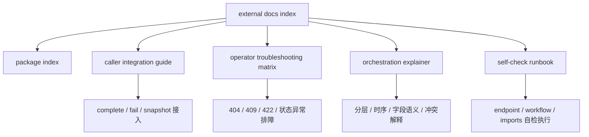

# Runtime terminal external docs index v1

## 1. 文档定位

本文档是 runtime terminal v1 的**对外文档首页 / 导航页**。

它面向的不是单一角色，而是所有需要快速进入 runtime terminal 文档包的人，包括：
- caller / worker / orchestrator 接入方
- 值班排障人员
- 新接手维护者
- 评审者 / 交接接收方

它要解决的核心问题只有 4 个：

1. 现在 runtime terminal v1 对外到底有哪些文档
2. 每份文档分别回答什么问题
3. 不同角色应该先看哪份，再看哪份
4. 遇到接入、排障、自检、语义解释等问题时，应该跳到哪里

本文档不重开实现语义，不替代 contract，也不扩写内部实现；它只负责把当前已经存在的外部说明材料整理成一个统一入口。

---

## 2. 适用范围

当前 external docs index 仅覆盖 runtime terminal v1 已完成、已封板、已可对外交付的文档材料，围绕以下固定范围组织：
- base prefix：`/api/v1/runtime/terminal`
- `POST /complete`
- `POST /fail`
- `GET /jobs/{job_id}`
- caller 接入说明
- operator 排障说明
- self-check / runbook
- orchestration 解释
- package 总览 / 导航

不在本文档内重开的范围：
- complete / fail 写侧语义变更
- facade 绕过 service 直接写 repository
- 冻结测试 `tests/test_runtime_terminal_workflow.py` 的改动
- 422 validator 行为改造

---

## 3. 对外文档总览

## 3.1 推荐作为对外交付的主文档

| 文档 | 主要受众 | 主要回答的问题 |
|---|---|---|
| `runtime_terminal_caller_integration_guide_v1.md` | caller / worker / orchestrator 接入方 | 什么时候调 complete/fail，409/422/404 怎么处理，调完如何核验 |
| `runtime_terminal_operator_troubleshooting_matrix_v1.md` | 值班 / 排障人员 | 常见症状、可能原因、优先检查点、self-check 动作、升级建议 |
| `runtime_terminal_orchestration_explainer_v1.md` | 接入方、维护者、评审者 | 分层、字段语义、时序、冲突语义、retry 判断 |
| `runtime_terminal_self_check_runbook.md` | 维护者、排障人员 | self-check 怎么跑、跑哪些检查项、如何解释结果 |
| `runtime_terminal_package_index_v1.md` | 维护者、交接接收方 | 现有 package 组成、职责边界、冻结事实、增量方向 |

## 3.2 它们之间的关系

可以把这 5 份文档理解成：
- `caller integration guide`：**给写入方 / 调用方看的**
- `operator troubleshooting matrix`：**给值班排障看的**
- `orchestration explainer`：**给想理解“为什么这样设计”的人看的**
- `self-check runbook`：**给要执行验证动作的人看的**
- `package index`：**给要做交接、导航、全景盘点的人看的**

一句话：
- **caller guide 管怎么接，operator matrix 管怎么排，explainer 管怎么懂，self-check runbook 管怎么验，package index 管怎么总览。**

---

## 4. 按问题找文档

## 4.1 我是调用方，我只想知道怎么接

先看：
1. `runtime_terminal_caller_integration_guide_v1.md`
2. `runtime_terminal_orchestration_explainer_v1.md`

典型问题：
- 什么场景该调 `POST /complete`
- 什么场景该调 `POST /fail`
- 4 个身份字段为什么必须来自同一次 attempt
- 409 是不是能直接重试
- 调完后怎么用 snapshot 核验

## 4.2 我是值班人员，我现在要排障

先看：
1. `runtime_terminal_operator_troubleshooting_matrix_v1.md`
2. `runtime_terminal_self_check_runbook.md`
3. `runtime_terminal_orchestration_explainer_v1.md`

典型问题：
- 404 / 409 / 422 到底该先查哪一层
- 200 但状态不符合预期该怎么看
- lease conflict 和 state conflict 如何区分
- 什么时候跑 `endpoint / workflow / imports`

## 4.3 我是新接手维护者，我想先看全貌

先看：
1. `runtime_terminal_package_index_v1.md`
2. `runtime_terminal_orchestration_explainer_v1.md`
3. `runtime_terminal_self_check_runbook.md`
4. `runtime_terminal_caller_integration_guide_v1.md`
5. `runtime_terminal_operator_troubleshooting_matrix_v1.md`

典型问题：
- 现在已经交付了什么
- 哪些边界被冻结了
- 现有文档分别解决什么问题
- 后续扩展应该接在哪一层

## 4.4 我是评审 / 交接接收方，我只想快速确认文档包是否完整

先看：
1. 本文档
2. `runtime_terminal_package_index_v1.md`
3. `runtime_terminal_caller_integration_guide_v1.md`
4. `runtime_terminal_operator_troubleshooting_matrix_v1.md`

典型问题：
- caller 侧是否有独立接入文档
- operator 侧是否有独立排障矩阵
- self-check 是否有可执行 runbook
- 是否存在统一导航入口

---

## 5. 按角色推荐阅读顺序

## 5.1 Caller / Worker / Orchestrator 接入开发者

推荐顺序：
1. `runtime_terminal_caller_integration_guide_v1.md`
2. `runtime_terminal_orchestration_explainer_v1.md`
3. `runtime_terminal_operator_troubleshooting_matrix_v1.md`（只看错误处理部分即可）

原因：
- 先知道怎么调
- 再知道为什么这么调
- 最后补齐故障情况下怎么判断不要误重试

## 5.2 Operator / 值班人员

推荐顺序：
1. `runtime_terminal_operator_troubleshooting_matrix_v1.md`
2. `runtime_terminal_self_check_runbook.md`
3. `runtime_terminal_orchestration_explainer_v1.md`

原因：
- 先拿到矩阵直接处理现场问题
- 再拿到可执行检查动作
- 最后补齐底层语义理解

## 5.3 新维护者

推荐顺序：
1. `runtime_terminal_package_index_v1.md`
2. `runtime_terminal_orchestration_explainer_v1.md`
3. `runtime_terminal_self_check_runbook.md`
4. `runtime_terminal_caller_integration_guide_v1.md`
5. `runtime_terminal_operator_troubleshooting_matrix_v1.md`

原因：
- 先看包级全景
- 再看分层和语义
- 再看验证入口
- 最后分别看 caller/operator 两个外部视角

---

## 6. 最小文档导航图

理解方式：
- `external docs index` 是入口页
- `package index` 是总览页
- `caller guide` 和 `operator matrix` 是两张最常用的角色化入口
- `explainer` 和 `self-check runbook` 是支撑性说明材料

---

## 7. 文档职责边界速记

| 文档 | 负责什么 | 不负责什么 |
|---|---|---|
| `runtime_terminal_external_docs_index_v1.md` | 对外导航、阅读入口、角色分流 | 重新定义 contract 或实现语义 |
| `runtime_terminal_package_index_v1.md` | package 全景、职责边界、冻结事实 | 直接指导 caller 接入细节 |
| `runtime_terminal_caller_integration_guide_v1.md` | complete/fail/snapshot 接入与返回处理 | 值班矩阵式排障流程 |
| `runtime_terminal_operator_troubleshooting_matrix_v1.md` | symptom→cause→check→action→escalation 排障矩阵 | 替代 contract 或 caller 集成指南 |
| `runtime_terminal_orchestration_explainer_v1.md` | 架构层次、编排时序、冲突解释、字段语义 | 充当值班现场 runbook |
| `runtime_terminal_self_check_runbook.md` | 自检命令、参数、输出、判定标准 | 定义新的 API contract |

---

## 8. 推荐对外交付组合

如果你只想发给不同对象最少的文档组合，建议如下：

### 8.1 发给 caller / SDK 接入方
- `runtime_terminal_caller_integration_guide_v1.md`
- `runtime_terminal_orchestration_explainer_v1.md`

### 8.2 发给 operator / 值班人员
- `runtime_terminal_operator_troubleshooting_matrix_v1.md`
- `runtime_terminal_self_check_runbook.md`

### 8.3 发给接手维护者 / 交接对象
- `runtime_terminal_package_index_v1.md`
- `runtime_terminal_orchestration_explainer_v1.md`
- `runtime_terminal_self_check_runbook.md`
- `runtime_terminal_caller_integration_guide_v1.md`
- `runtime_terminal_operator_troubleshooting_matrix_v1.md`

### 8.4 发给评审者 / 管理侧
- 本文档
- `runtime_terminal_package_index_v1.md`

---

## 9. 当前 external docs 包的完成度判断

从当前文档组合看，runtime terminal v1 的外部资料已经具备以下能力：
- 有 caller 侧接入说明
- 有 operator 侧排障矩阵
- 有 orchestration 层解释文档
- 有 self-check 执行 runbook
- 有 package 级总览
- 现在再加上统一 external docs index 入口

因此目前可以认为：
- **runtime terminal v1 的对外文档包已经从“零散说明”进入“可交付、可导航、可角色化使用”的状态。**

---

## 10. 后续最自然的增量方向

在不重开 v1 冻结边界的前提下，如果后面还要继续补外部材料，最自然的两个方向是：

### 10.1 SDK usage snippet pack
给 caller / worker 提供：
- Python 示例
- 伪代码模板
- complete/fail/snapshot 的最小调用片段
- 409 / 422 的 caller 侧处理骨架

### 10.2 FAQ / decision memo
给评审、接入方、值班方提供：
- 为什么 422 不包成 terminal error schema
- 为什么 facade 写侧不能绕过 service
- 为什么 409 要区分 lease conflict / state conflict
- 为什么 `error_payload_json` 不能显式传 `null`

---

## 11. 一页版结论

如果你只记住一句话，请记住：

- **runtime terminal external docs v1 的入口从现在开始就是本文档；接入先看 caller guide，排障先看 operator matrix，理解设计看 explainer，执行验证看 self-check runbook，全景与交接看 package index。**
