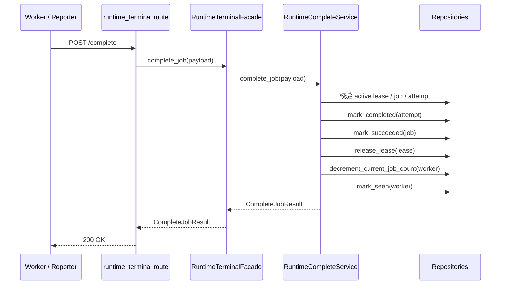
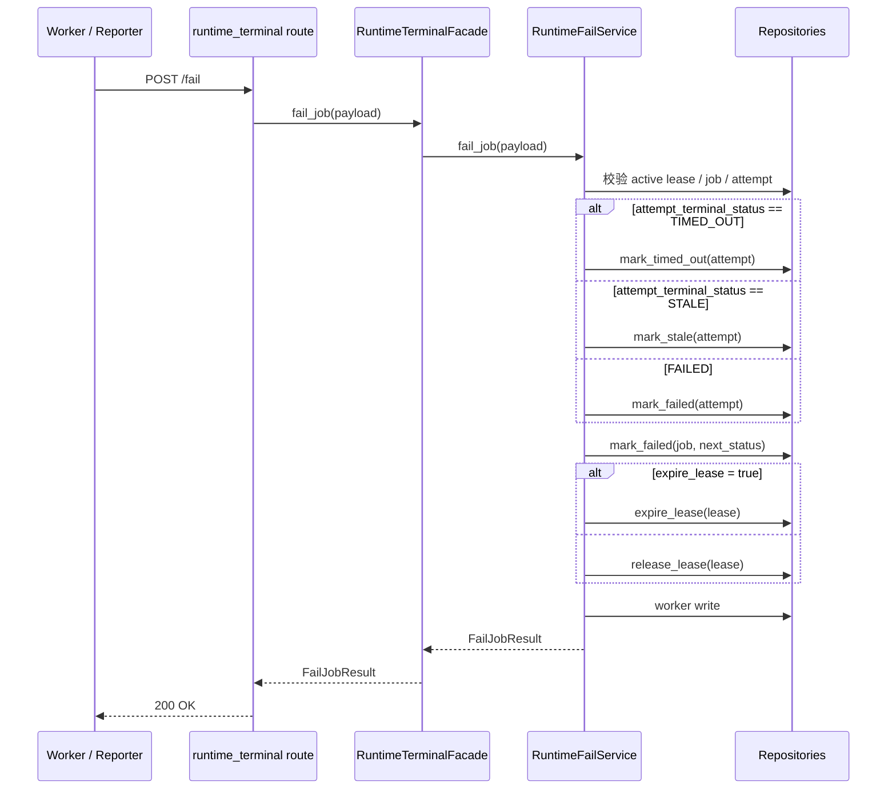
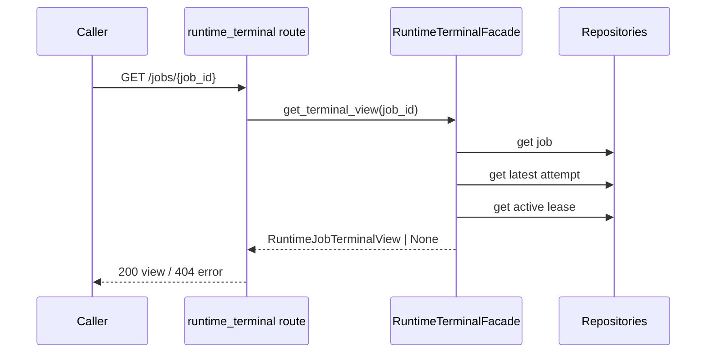

# Runtime terminal orchestration explainer v1

## 1. 文档定位

本文档不是重新定义 `Runtime terminal workflow / service 编排最小实现包 v1` 的写侧契约，而是为维护者、调用方、排障人员补一层**外部说明**，回答以下问题：

- terminal complete / fail / read 三个入口在编排上分别处于什么位置
- 上层调用前必须满足哪些前置条件
- 什么时候会返回 404 / 409 / 422，以及这些结果分别意味着什么
- `GET /jobs/{job_id}` 返回的 terminal snapshot 字段应该如何阅读
- 遇到失败或冲突时，应该选择 retry，还是转人工排查

本文档严格遵守当前冻结边界：
- 不改变 complete/fail 既有写侧语义
- facade 写侧不绕过现有 service 直写 repository
- 不触碰 `tests/test_runtime_terminal_workflow.py`
- 422 继续保持 FastAPI / Pydantic 默认行为

---

## 2. 三个 terminal 入口分别解决什么问题

当前对外暴露的 terminal 入口只有 3 个：

- `POST /api/v1/runtime/terminal/complete`
- `POST /api/v1/runtime/terminal/fail`
- `GET /api/v1/runtime/terminal/jobs/{job_id}`

可以把它们理解为：

1. `complete`
   - 用于 worker 已成功完成一次 attempt 后，向 runtime 写回“成功终态”
   - 该操作会驱动 attempt、job、lease、worker 四类状态协同收口

2. `fail`
   - 用于 worker 已确认本次 attempt 不能继续成功完成时，向 runtime 写回“失败类终态”
   - 支持失败、超时、stale 三种 attempt terminal 分支
   - 同时允许 job 进入 `FAILED / WAITING_RETRY / STALE`

3. `GET /jobs/{job_id}`
   - 用于读取当前 job 的 terminal snapshot
   - 本质是一个面向排障 / 对账 / 状态核验的聚合读模型
   - 它不是新的调度入口，也不是重放入口

一句话理解：
- `complete` / `fail` 负责**写终态**
- `GET /jobs/{job_id}` 负责**看终态快照**

---

## 3. 编排分层：谁负责什么

当前分层需要按下面的方式理解：

### 3.1 route 层
负责：
- 接收 HTTP request
- 触发 Pydantic/FastAPI 参数校验
- 调用 facade
- 把已知冲突映射为统一 404 / 409 顶层 JSON 错误结构

不负责：
- 直接写 repository
- 重新拼事务顺序
- 自定义改写 422 validator 错误

### 3.2 facade 层
`RuntimeTerminalFacade` 的职责分两类：

1. 写侧委托
   - `complete_job(request)` → `RuntimeCompleteService.complete_job(request)`
   - `fail_job(request)` → `RuntimeFailService.fail_job(request)`

2. 读侧聚合
   - `get_terminal_view(job_id)` 聚合：
     - job
     - latest attempt
     - active lease

因此 facade 是：
- 写侧的**边界保持器**
- 读侧的**最小聚合层**

它不是新的业务编排中心，也不是 repository 的替代品。

### 3.3 service 层
service 负责真正的 terminal 写事务语义：
- lease 校验
- job terminal / claim 校验
- attempt owner / status 校验
- terminal 状态落库
- lease 释放或过期
- worker current_job_count / seen 状态更新

### 3.4 repository 层
repository 负责具体实体读写，不承担 API contract 解释责任。

---

## 4. 三个入口的推荐时序

## 4.1 success path：worker 成功完成后回写

适用时机：
- 本次 attempt 已得到有效成功结果
- reporter 确认自己仍持有匹配的 lease / claim_token
- 不再需要把该 attempt 留在 active 运行态

### 4.2 fail path：worker 失败/超时/stale 后回写

适用时机：
- 本次 attempt 已明确无法继续成功完成
- 需要把失败原因、终态类型、后续 job 状态一并写入
- 调用方已决定这是 `FAILED`、`WAITING_RETRY` 或 `STALE` 中哪一种 job 走向

### 4.3 read path：运维/调试/上层核验读取 terminal snapshot

适用时机：
- 需要确认某个 job 当前 terminal 收口状态
- 需要观察 latest attempt 的错误信息或结果引用
- 需要判断 active lease 是否仍存在

不适用时机：
- 想通过该接口驱动状态推进
- 想用它代替 claim / heartbeat / 调度流程

---

## 5. 上层调用前置条件

## 5.1 调用 `POST /complete` 前，应满足

必须同时成立：
- 调用方知道 `job_id`
- 调用方知道本次运行对应的 `attempt_id`
- 调用方知道持有 lease 的 `worker_id`
- 调用方持有有效 `claim_token`
- 该 job 尚未被其他路径写成 terminal
- 该 attempt 与 worker / claim_token 仍一致

建议同时满足：
- 成功产物引用已经确定，例如 `result_ref`
- 若存在 manifest 产物，`manifest_artifact_id` 已可稳定写入
- `runtime_ms / provider_runtime_ms / upload_ms` 已完成采集

不建议在以下情况下调用：
- 实际结果仍未落定，只是“看起来快成功了”
- lease 可能已失效但尚未核验
- 不确定本次请求对应哪一个 attempt

## 5.2 调用 `POST /fail` 前，应满足

必须同时成立：
- 调用方确认本次 attempt 需要写失败类终态
- `next_job_status` 已在 `FAILED / WAITING_RETRY / STALE` 中选定
- `attempt_terminal_status` 已在 `FAILED / TIMED_OUT / STALE` 中选定
- `job_id / attempt_id / worker_id / claim_token` 与真实运行上下文一致

建议同时满足：
- `error_code` 有稳定的机器可读值
- `error_message` 或 `terminal_reason` 能帮助后续人工排障
- 如果需要保留上下文细节，放入 `error_payload_json`

不建议在以下情况下调用：
- 调用方尚未决定 job 是立即失败还是等待重试
- 只是瞬时网络波动，且 worker 仍可能继续完成
- 想用 `fail` 来纠正历史错误写入

## 5.3 调用 `GET /jobs/{job_id}` 前，应理解

- 它返回的是**当前聚合快照**，不是事件流回放
- `latest_attempt` 是“最新 attempt”，不等于“唯一 attempt”
- `active_lease` 为 `null` 不一定代表系统异常，也可能是正常释放后的结果
- 若 job 不存在，将返回 404 顶层错误结构，而不是空对象

---

## 6. 字段语义速查

## 6.1 写侧请求中的关键身份字段

### `job_id`
标识 runtime job 主体。所有 terminal 行为最终都围绕这个 job 收口。

### `attempt_id`
标识当前这一次执行尝试。terminal 写入必须落到正确 attempt 上，否则会触发冲突或错误归属混乱。

### `worker_id`
标识当前持有并执行该 attempt 的 worker。用于校验 lease / attempt owner 一致性。

### `claim_token`
标识当前活跃 claim / lease 归属。它是写 terminal 时最关键的并发防护字段之一。

---

## 6.2 `POST /complete` 的业务字段

### `completion_status`
attempt 成功完成时的上层完成状态补充信息。它不是 job terminal 状态本身，而是成功结果的附加标记。

### `terminal_reason`
成功收口时的附加说明。通常用于记录简短原因、归因或外层语义标签。

### `result_ref`
成功结果引用，例如产物地址、对象键、外部记录引用。

### `manifest_artifact_id`
manifest 类产物的标识。当前兼容 `UUID | str | None`，调用方可逐步过渡。

### `runtime_ms / provider_runtime_ms / upload_ms`
分别用于表达：
- 总运行耗时
- provider 侧耗时
- 上传耗时

这些字段主要服务于排障、监控和后续成本/性能分析。

### `metadata_json`
调用方自带的附加上下文。适合放轻量、非主索引的补充信息。

---

## 6.3 `POST /fail` 的业务字段

### `next_job_status`
表示 job 终态/下一步走向，只允许：
- `FAILED`
- `WAITING_RETRY`
- `STALE`

理解方式：
- `FAILED`：这次失败后 job 直接进入失败终态
- `WAITING_RETRY`：这次 attempt 失败，但系统预期后续还会重试 job
- `STALE`：job 当前被判定为陈旧/失效，不再按正常成功路径继续

### `attempt_terminal_status`
表示 attempt 自身的终态，只允许：
- `FAILED`
- `TIMED_OUT`
- `STALE`

理解方式：
- `FAILED`：执行完成但失败
- `TIMED_OUT`：超时收口
- `STALE`：attempt 自身被认定无效/陈旧

### `terminal_reason`
优先作为面向人的终态说明。

### `error_code`
优先作为面向机器的失败分类码。当前 service 侧也会把它用于 `terminal_reason_code` 的归并优先级。

### `error_message`
补充说明错误文本；在未提供 `terminal_reason` 时，可成为终态消息来源。

### `error_payload_json`
结构化错误上下文容器。适合保存 provider response、阶段信息、外层 trace 片段等。

边界提醒：
- 不能显式传 `null`
- 如果需要走“未提供时继承既有 payload”的语义，应省略字段而不是传 `None`

### `expire_lease`
控制 lease 在失败写入后是：
- `true` → 过期
- `false` → 释放

它不是 attempt 状态选择器，而是 lease 收口策略开关。

---

## 6.4 `GET /jobs/{job_id}` 返回体中的关键字段

## 顶层 job 视角

### `job_status`
当前 job 的总体状态。它是最先回答“这个 job 现在整体到哪一步了”的字段。

### `claimed_by_worker_id`
当前 job 记录上认为由哪个 worker 持有。若为 `null`，通常表示未被 claim 或 claim 已释放/清理。

### `active_claim_token`
当前 job 上记录的活动 claim token。用于与 active lease / attempt 做并发归属核对。

### `attempt_count`
该 job 已创建的 attempt 数量。用于判断是否经历过重试或多次执行。

### `queued_at / claimed_at / started_at / finished_at`
一组时间锚点：
- `queued_at`：进入队列
- `claimed_at`：被 worker claim
- `started_at`：开始执行
- `finished_at`：完成 terminal 收口

### `lease_expires_at`
job 视角记录的 lease 过期时间。用于辅助判断 lease 是否曾被持有以及何时理论到期。

### `terminal_reason_code / terminal_reason_message`
job 级终态归因字段：
- code 更偏机器可读
- message 更偏人工解释

### `metadata_json`
job 级补充上下文。

## `latest_attempt` 视角

### `attempt_status`
最新 attempt 当前终态或进行态。判断本次尝试到底是 completed、failed、timed_out 还是 stale，先看这里。

### `attempt_index`
第几次 attempt，从排障角度尤其重要，可快速判断是否属于重试链路。

### `completion_status`
成功类完成补充状态；不是所有 attempt 都会有值。

### `error_code / error_message / error_payload_json`
失败类排障三件套：
- `error_code`：机器可读分类
- `error_message`：人工可读摘要
- `error_payload_json`：结构化上下文细节

### `result_ref / manifest_artifact_id`
成功产物定位字段。

### `runtime_ms / provider_runtime_ms / upload_ms`
性能与阶段耗时观察字段。

### `metrics_json / metadata_json`
attempt 级附加指标与上下文。

## `active_lease` 视角

### `lease_status`
当前 active lease 的状态。如果这里仍存在活动 lease，通常表示该 job 仍处于某种持有期内。

### `lease_started_at / lease_expires_at`
lease 生命周期窗口。

### `last_heartbeat_at`
最后一次心跳时间。用于判断 worker 是否仍在持续上报。

### `heartbeat_count / extension_count`
lease 活跃程度与续租行为的观察字段。

### `revoked_at / revoked_reason`
若 lease 被撤销，可通过这两个字段读取原因痕迹。

---

## 7. 404 / 409 / 422 应该如何理解

## 7.1 404：资源不存在

当前主要体现在：
- `GET /api/v1/runtime/terminal/jobs/{job_id}`

典型含义：
- 指定的 `job_id` 不存在
- 或调用方引用了一个尚未落库/已错误拼写的 job 标识

这类问题通常不是“重试一次就会自然恢复”的运行态冲突，而更像：
- 参数错误
- 观测对象错误
- 上下游引用不同步

建议动作：
- 先核对 `job_id`
- 再核对上游是否真的完成 job 创建/持久化
- 不要无脑高频重试

## 7.2 409：状态冲突或 lease 冲突

当前 complete / fail 都可能返回 409，且会区分：

### `runtime_lease_conflict`
通常表示：
- `worker_id` 不匹配
- `claim_token` 已无效或不归当前调用方
- attempt/lease owner 不一致

本质上是“你没有资格为当前活跃执行上下文写 terminal”。

### `runtime_state_conflict`
通常表示：
- job 已经进入 terminal
- 当前 attempt/job 状态与请求不再兼容

本质上是“这个 terminal 写入时机已经错过或被其他路径先一步完成”。

409 不一定意味着系统坏了，更常见的是：
- 重复上报
- 迟到上报
- 并发竞争
- claim 上下文过期

## 7.3 422：请求自身不合法

422 继续保持 FastAPI / Pydantic 默认行为，不转成 terminal error schema。

典型触发方式：
- `next_job_status` 不在允许集合内
- `attempt_terminal_status` 不在允许集合内
- 字段类型不匹配
- 必填字段缺失
- 显式传了不允许的 `null`

422 的核心含义不是运行期冲突，而是“请求构造错误”。

建议动作：
- 修调用方 payload
- 不要把 422 当成短暂系统故障重试

---

## 8. retry 还是人工排查：实用判断准则

## 8.1 可以优先 retry 的情况

更适合自动 retry / 有节制重试的，是以下情况：
- `POST /fail` 明确把 `next_job_status` 置为 `WAITING_RETRY`
- 失败原因已知且被系统设计为可恢复，例如短暂 provider 抖动
- terminal 写入尚未发生，只是上游业务步骤失败，且 lease 仍有效

前提是：
- retry 由正式调度语义驱动
- 不是靠重复猛打 terminal endpoint 解决

换句话说，**重试的是业务执行，不是盲目重试 terminal 写接口本身。**

## 8.2 不应直接 retry，应先人工排查的情况

以下情况更适合先人工看 snapshot 和日志：
- 409 `runtime_lease_conflict`
- 409 `runtime_state_conflict`
- 404 job not found
- 422 validator error
- 同一 job 多次出现不一致 terminal 回写
- `active_lease`、`active_claim_token`、`latest_attempt.claim_token` 之间看起来不一致

因为这些问题多半不是瞬时抖动，而是：
- 调用方上下文错误
- 并发/重复写入
- 任务编排时序偏移
- 调用方集成代码 bug

## 8.3 一个实用排障顺序

建议按以下顺序看：

1. 先读 `GET /jobs/{job_id}`
2. 看 `job_status`
3. 看 `latest_attempt.attempt_status`
4. 看 `active_lease` 是否仍存在
5. 核对 `worker_id + claim_token + attempt_id`
6. 再决定是：
   - 继续等待
   - 触发正式 retry
   - 人工介入清理/修复

---

## 9. 常见场景解释

## 9.1 worker 成功完成，但回写 `complete` 时收到 409

优先怀疑：
- lease 已失效或已被释放
- 另一路已经先完成 terminal 写入
- reporter 用了旧的 claim_token / attempt_id

建议：
- 先读 terminal snapshot
- 若 job 已成功 terminal，则通常不需要再次写 `complete`
- 若状态异常不一致，再进入人工排查

## 9.2 worker 失败后想重试，应该调用什么

不是直接重复调用 `fail` 多次，而是：
- 用一次 `fail` 正确声明本次 attempt 的 terminal 结果
- 若希望后续重试，使用 `next_job_status=WAITING_RETRY`
- 后续真正的 retry 应由正式调度链路推进

## 9.3 `active_lease` 是 `null`，是不是异常

不一定。

在正常 complete / fail 收口后：
- lease 可能已被 release
- 或根据失败策略被 expire

因此 `active_lease = null` 只能说明“当前无 active lease 聚合出来”，不能单独证明系统故障。

## 9.4 看到 `attempt_status` 是 `STALE`，该怎么理解

表示这次 attempt 已被判定为 stale，不应再按正常活跃执行处理。
这通常指向：
- 执行上下文陈旧
- 任务已被替代或过期
- 该 attempt 不再适合作为继续执行基础

---

## 10. 调用方最小实践建议

如果你是 terminal 调用方，实现上至少应做到：

1. 始终显式保存 `job_id / attempt_id / worker_id / claim_token`
2. 成功与失败分别走 `complete` / `fail`，不要混用
3. 不把 409 / 422 当作统一的“可重试网络错误”
4. 在自动化恢复前，优先读取 `GET /jobs/{job_id}` 做状态核对
5. 对 `error_code / error_message / metadata_json` 保持稳定约定，方便排障

---

## 11. frozen boundary 再强调

当前 explainer 仅解释已封板的 v1 行为，不授权以下变更：
- 修改 complete/fail 事务顺序
- 让 facade 绕过 service 直接落写 repository
- 把 422 强行折叠进 terminal error schema
- 扩大 terminal read model 范围到旧读侧服务或其他聚合路径

如后续需要重开，触发条件应是：
- 新的语义源变化
- 新的上层 orchestrator contract 需求
- 当前 404 / 409 / 422 边界无法覆盖新增场景

---

## 12. 一句话结论

runtime terminal v1 当前已经形成清晰分工：
- `complete` / `fail` 负责以冻结语义收口 terminal 写侧
- `GET /jobs/{job_id}` 负责提供可排障、可核验的 terminal snapshot
- 409 更像“上下文/时序冲突”，422 更像“请求构造错误”，404 更像“观测对象不存在”

对调用方而言，最重要的不是“多打几次接口”，而是：
**先保证 claim 上下文正确，再根据 snapshot 判断应该 retry 还是人工介入。**
