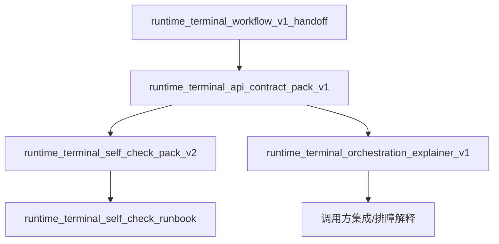

# Runtime terminal package index v1

## 1. 文档目的

本文档用于把当前已经封板的 runtime terminal 相关交付物组织成一个**可交接、可导航、可续做**的 package overview，方便后续维护者、接入方、排障人员快速回答 3 个问题：

1. runtime terminal v1 这条工作流到底已经交付了什么
2. 每份文档分别解决什么问题、适合谁读
3. 如果后续继续扩展，应该从哪份材料切入，而不是重新翻代码或重复确认冻结语义

本文档本身不引入新的写侧语义，也不重开已冻结的 contract 边界；它只负责把现有成果编排清楚。

---

## 2. package 范围

当前 package 讨论范围仅覆盖 runtime terminal v1 已完成并已确认的材料：

### 2.1 代码/接口范围
- base prefix：`/api/v1/runtime/terminal`
- endpoint：
  - `POST /complete`
  - `POST /fail`
  - `GET /jobs/{job_id}`

### 2.2 语义范围
- complete terminal write
- fail terminal write
- terminal snapshot read
- 404 / 409 / 422 边界
- self-check / regression 运行说明
- orchestration explainer 外部说明

### 2.3 明确不在本 package 内重开的范围
- complete/fail 写侧事务顺序变更
- facade 绕过 service 直接写 repository
- 冻结测试 `tests/test_runtime_terminal_workflow.py` 的修改
- 422 改造成 terminal error schema
- 回退到旧 `RuntimeStateService` 读侧路径

---

## 3. package 内文档清单

## 3.1 核心交付物总表

| 文档 | 位置 | 角色 | 主要读者 | 解决的问题 |
|---|---|---|---|---|
| `runtime_terminal_workflow_v1_handoff.md` | `outputs/` | 交接/封口说明 | 接手开发者、维护者 | 说明 runtime terminal v1 最小实现包已完成到什么程度 |
| `runtime_terminal_api_contract_pack_v1.md` | `outputs/` | 契约封板文档 | API 接入方、后续开发者 | 明确 endpoint、schema、错误边界、冻结约束 |
| `runtime_terminal_self_check_pack_v2.md` | `outputs/` | 自检与回归说明 | 维护者、值班排障人员 | 说明如何执行 self-check、如何选择 check 组合 |
| `runtime_terminal_orchestration_explainer_v1.md` | `outputs/` | 外部说明文档 | 调用方、维护者、排障人员 | 解释分层、字段语义、时序、冲突语义、retry 判断 |
| `runtime_terminal_self_check_runbook.md` | `docs/runbooks/` | 仓内 runbook | 仓内维护者 | 提供 self-check 的执行入口、步骤和解释 |
| `runtime_terminal_orchestration_explainer_v1.md` | `docs/contracts/` | 仓内 explainer | 仓内维护者 | 保留与输出版同步的 explainer 归档 |

> 当前对外可优先引用 outputs 目录下版本；仓内 `docs/` 版本适合做持续维护与后续增补。

---

## 4. 推荐阅读顺序

不同角色，建议采用不同阅读顺序。

## 4.1 新接手维护者

建议顺序：
1. `runtime_terminal_workflow_v1_handoff.md`
2. `runtime_terminal_api_contract_pack_v1.md`
3. `runtime_terminal_self_check_pack_v2.md`
4. `runtime_terminal_orchestration_explainer_v1.md`

原因：
- 先知道“已经做到哪”
- 再知道“哪些边界被冻结了”
- 再知道“怎么验证现状没坏”
- 最后理解“调用编排和字段语义该怎么解释”

## 4.2 API 接入方 / 调用方

建议顺序：
1. `runtime_terminal_api_contract_pack_v1.md`
2. `runtime_terminal_orchestration_explainer_v1.md`

原因：
- contract pack 先回答“怎么调、返回什么”
- explainer 再回答“为什么会这样、冲突时怎么判断”

## 4.3 值班 / 排障人员

建议顺序：
1. `runtime_terminal_orchestration_explainer_v1.md`
2. `runtime_terminal_self_check_pack_v2.md`
3. `runtime_terminal_self_check_runbook.md`

原因：
- 先建立问题分类方式
- 再看自检组合和期望结果
- 最后用 runbook 执行排障动作

---

## 5. 每份文档的职责边界

## 5.1 handoff 文档负责什么

`runtime_terminal_workflow_v1_handoff.md` 主要负责：
- 说明该工作流最小闭环已经落地
- 总结已完成实现面
- 记录冻结边界和交接上下文

它不负责：
- 展开完整字段语义
- 充当逐字段 contract 手册
- 代替自检运行说明

## 5.2 contract pack 负责什么

`runtime_terminal_api_contract_pack_v1.md` 主要负责：
- endpoint 一览
- request / response schema 说明
- 404 / 409 / 422 行为边界
- complete / fail 冻结写侧顺序与约束说明

它不负责：
- 做面向外部读者的长篇解释
- 代替 runbook
- 代替 package index

## 5.3 self-check pack 负责什么

`runtime_terminal_self_check_pack_v2.md` 主要负责：
- 说明默认回归入口
- 说明 `--list-checks`、多次 `--check`、逗号组合、`all` 等能力
- 明确非法 check 的退出码与行为
- 说明如何最小化验证封板状态仍成立

它不负责：
- 重新定义 API contract
- 替代 orchestration explainer

## 5.4 orchestration explainer 负责什么

`runtime_terminal_orchestration_explainer_v1.md` 主要负责：
- 解释 route / facade / service / repository 分层
- 用 sequence diagram 解释 complete / fail / read 三类编排
- 解释 field semantics
- 解释 precondition / conflict semantics
- 解释 retry vs manual investigation guidance

它不负责：
- 变更现有写侧语义
- 代替 contract pack 成为唯一契约源

---

## 6. package 导航图

理解方式：
- handoff 是封口入口
- contract pack 是契约中心
- self-check pack 是验证入口
- explainer 是外部说明入口
- runbook 是执行入口

---

## 7. 当前 package 的冻结事实

以下事实应视为 package index 层面的默认前提，不需要每次重新确认：

### 7.1 接口冻结事实
- base prefix 固定为 `/api/v1/runtime/terminal`
- 仅 3 个 terminal endpoint：`POST /complete`、`POST /fail`、`GET /jobs/{job_id}`
- `GET /jobs/{job_id}` 的 job 不存在返回 404
- `POST /complete`、`POST /fail` 的 lease/state 冲突返回 409 顶层错误结构
- 422 维持 FastAPI / Pydantic 默认 validator 结构

### 7.2 架构冻结事实
- route 是 HTTP 入口
- facade 是写侧委托边界 + 读侧最小聚合层
- service 持有 terminal 写语义
- repository 负责底层存取
- facade 写侧不能绕过 service 直接写 repository

### 7.3 测试/验证冻结事实
- `tests/test_runtime_terminal_workflow.py` 冻结不碰
- endpoint suite、workflow suite、self-check 既有验证已通过
- `/mnt/user-data/workspace/.venv` 是后续优先执行环境

---

## 8. 仓内与输出侧的关系

当前 runtime terminal package 存在两类文档位置：

### 8.1 仓内 `docs/`
适合：
- 与代码共同演进
- 后续补充增量说明
- 作为 repo 内长期保留的维护材料

### 8.2 输出侧 `outputs/`
适合：
- 面向用户或交接方直接查看
- 固化某一版本的 package 产物
- 做阶段性交付留档

推荐原则：
- 需要“对外引用”时，优先给 `outputs/` 文件
- 需要“继续编辑维护”时，优先改 `docs/` 源文件，再同步输出版本

---

## 9. 用什么文档回答什么问题

如果问题是：**“这个能力已经做完了吗？”**
- 先看：`runtime_terminal_workflow_v1_handoff.md`

如果问题是：**“接口怎么调、参数和返回长什么样？”**
- 先看：`runtime_terminal_api_contract_pack_v1.md`

如果问题是：**“怎么快速验证现在没坏？”**
- 先看：`runtime_terminal_self_check_pack_v2.md`
- 再看：`docs/runbooks/runtime_terminal_self_check_runbook.md`

如果问题是：**“为什么会返回 409？什么时候该 retry？”**
- 先看：`runtime_terminal_orchestration_explainer_v1.md`

如果问题是：**“后面扩文档应该接在哪？”**
- 先看本文档，再决定落到 contract / runbook / explainer 哪一层

---

## 10. 后续最自然的增量方向

在不重开 v1 冻结边界的前提下，当前 package 最自然的后续方向有三类：

### 10.1 operator troubleshooting matrix
补一份值班/排障矩阵，按以下维度组织：
- symptom
- probable cause
- snapshot check points
- self-check action
- escalation guidance

### 10.2 caller integration guide
补一份调用方集成指引，重点提供：
- complete/fail/snapshot 示例请求
- 409 / 422 的处理策略建议
- claim_token / attempt_id 持久化建议

### 10.3 package overview 持续升级
如果后续 runtime terminal 再增加文档，可把本文档升级到 v2，增加：
- 文档依赖矩阵
- 版本演进记录
- “哪些文档是权威源” 的更细粒度说明

---

## 11. 当前 package 的最小结论

到目前为止，runtime terminal v1 已经不再只是“代码完成”，而是形成了一个相对完整的交付包：
- handoff 说明“做到了哪”
- contract 说明“接口是什么”
- self-check 说明“怎么验证没坏”
- explainer 说明“编排和语义怎么理解”
- 本 index 说明“这些材料之间如何组织和导航”

这意味着后续继续推进时，应优先在 package 层做增量组织，而不是回到零散状态重新解释同一批冻结事实。
