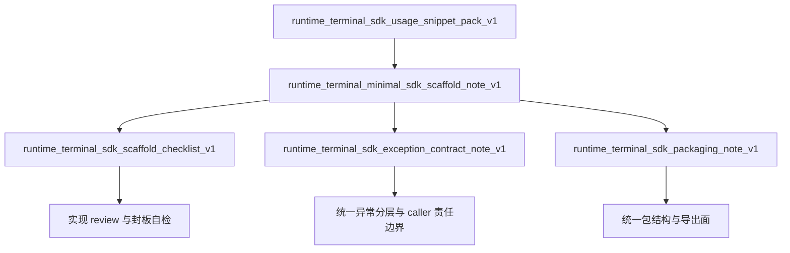

# Runtime terminal SDK docs index v1

## 1. 文档目的

本文档用于把当前已经完成的 runtime terminal v1 SDK 相关材料组织成一个**可导航、可交接、可续做**的统一入口，方便后续维护者、SDK 封装者、调用方和 review / 验收人员快速回答 4 个问题：

1. runtime terminal v1 的 SDK 文档集现在已经包含哪些材料
2. 每份文档分别解决什么问题、适合谁读
3. 如果要从 snippet 过渡到最小可维护 SDK，应该按什么顺序阅读
4. 后续继续补 SDK 交付物时，应该从哪一层继续，而不是重复发散设计

本文档本身不引入新的 API contract，不重开 complete / fail / snapshot 语义，也不改变当前 v1 冻结边界。它只负责把已经完成的 SDK 文档集串起来，形成一个清晰的入口页。

---

## 2. SDK 文档集范围

当前 index 只覆盖 runtime terminal v1 已完成、且直接服务于 **SDK / adapter / client 封装** 的材料：

- `runtime_terminal_sdk_usage_snippet_pack_v1.md`
- `runtime_terminal_minimal_sdk_scaffold_note_v1.md`
- `runtime_terminal_sdk_scaffold_checklist_v1.md`
- `runtime_terminal_sdk_exception_contract_note_v1.md`
- `runtime_terminal_sdk_packaging_note_v1.md`

这些文档共同覆盖的范围是：
- 如何从 endpoint snippet 过渡到最小 SDK
- SDK 的最小 public surface 应该是什么
- attempt context 应如何收束
- exception contract 最少应保留到什么程度
- package 结构、导出面、命名与发布边界应如何控制

它们共同依赖但不替代的外围材料包括：
- `runtime_terminal_caller_integration_guide_v1.md`
- `runtime_terminal_caller_faq_v1.md`
- `runtime_terminal_language_specific_error_mapping_appendix_v1.md`
- `runtime_terminal_package_index_v1.md`

换句话说，**本 index 只整理 SDK 文档主线，不重新收录整个 runtime terminal 全量文档包。**

---

## 3. 当前 SDK 文档清单

| 文档 | 位置 | 角色 | 主要读者 | 解决的问题 |
|---|---|---|---|---|
| `runtime_terminal_sdk_usage_snippet_pack_v1.md` | `docs/contracts/` | 接入样例包 | SDK 封装者、worker reporter 开发者 | 提供可直接复用/改造的 complete / fail / snapshot 调用片段 |
| `runtime_terminal_minimal_sdk_scaffold_note_v1.md` | `docs/contracts/` | 骨架说明 | Python SDK / adapter 封装者 | 说明最小 SDK scaffold 应该长什么样、该做什么/不该做什么 |
| `runtime_terminal_sdk_scaffold_checklist_v1.md` | `docs/contracts/` | 检查清单 | 实作者、reviewer、验收人 | 把 scaffold 原则压缩成逐项检查表 |
| `runtime_terminal_sdk_exception_contract_note_v1.md` | `docs/contracts/` | 异常契约说明 | SDK 封装者、平台维护者 | 固定最小异常分层、状态码映射与 caller / SDK 责任边界 |
| `runtime_terminal_sdk_packaging_note_v1.md` | `docs/contracts/` | packaging 说明 | SDK 维护者、交接负责人 | 固定包结构、导出面、命名、依赖和发布边界 |

如果后续需要对外展示或交付，建议将这些文档从 `docs/contracts/` 同步输出到 `outputs/` 版本；仓内 `docs/` 版本仍是继续维护的源文件。

---

## 4. 这些文档之间的关系

可以把当前 SDK 文档集理解成从“会调接口”到“能维护小包”的递进链条：

理解方式：
- snippet pack 回答“怎么调”
- scaffold note 回答“最小 SDK 应该长什么样”
- scaffold checklist 回答“实现后怎么检查自己没越界”
- exception note 回答“错误分类要保留到什么程度”
- packaging note 回答“这个 SDK 包该怎么组织、怎么收口”

---

## 5. 推荐阅读顺序

不同角色，建议使用不同阅读顺序。

### 5.1 第一次搭 SDK 的实现者

建议顺序：
1. `runtime_terminal_sdk_usage_snippet_pack_v1.md`
2. `runtime_terminal_minimal_sdk_scaffold_note_v1.md`
3. `runtime_terminal_sdk_exception_contract_note_v1.md`
4. `runtime_terminal_sdk_packaging_note_v1.md`
5. `runtime_terminal_sdk_scaffold_checklist_v1.md`

原因：
- 先知道 endpoint 到底怎么调
- 再知道最小骨架该如何收束
- 再冻结异常语义和包边界
- 最后用 checklist 做实现前后自检

### 5.2 code review / 验收人员

建议顺序：
1. `runtime_terminal_sdk_scaffold_checklist_v1.md`
2. `runtime_terminal_sdk_exception_contract_note_v1.md`
3. `runtime_terminal_sdk_packaging_note_v1.md`
4. `runtime_terminal_minimal_sdk_scaffold_note_v1.md`

原因：
- checklist 最适合先建立 review 维度
- exception 与 packaging 最容易成为越界点
- scaffold note 用于回看整体设计是否仍然收敛

### 5.3 调用方平台维护者

建议顺序：
1. `runtime_terminal_minimal_sdk_scaffold_note_v1.md`
2. `runtime_terminal_sdk_exception_contract_note_v1.md`
3. `runtime_terminal_sdk_usage_snippet_pack_v1.md`
4. `runtime_terminal_sdk_packaging_note_v1.md`

原因：
- 先看 SDK 角色边界
- 再看异常分层和 caller 责任
- 再看接入样例
- 最后看包如何作为可交接产物沉淀

---

## 6. 每份 SDK 文档的职责边界

### 6.1 `runtime_terminal_sdk_usage_snippet_pack_v1.md`

主要负责：
- 提供 complete / fail / snapshot 的最小可复用代码片段
- 帮调用方快速验证请求结构与字段表达
- 给后续 SDK 封装提供直接起点

不负责：
- 定义长期 public surface
- 固化 package 组织结构
- 固化异常契约分层

### 6.2 `runtime_terminal_minimal_sdk_scaffold_note_v1.md`

主要负责：
- 说明最小 SDK scaffold 应包含哪些对象
- 固定 `RuntimeAttemptContext`、`RuntimeTerminalClient`、`_request(...)` 等骨架概念
- 说明哪些能力应放进 v1，哪些不应提前做

不负责：
- 提供逐项 review checklist
- 细化 package 发布边界
- 深入展开异常契约设计

### 6.3 `runtime_terminal_sdk_scaffold_checklist_v1.md`

主要负责：
- 把 scaffold note 落成可逐项打勾的检查表
- 服务于实现、自检、review、交接验收
- 帮团队在落地时避免 scope creep

不负责：
- 替代设计说明文档
- 承担 SDK 使用样例包角色

### 6.4 `runtime_terminal_sdk_exception_contract_note_v1.md`

主要负责：
- 固定最小异常树
- 固定 `404 / 409 / 422 / 5xx / transport` 语义分层
- 说明 `_request(...)` 层该做什么、不该做什么
- 固定 caller 与 SDK 在错误处理上的责任边界

不负责：
- 改写 FastAPI / Pydantic 422 行为
- 变成复杂异常框架
- 替 caller 做自动恢复或业务决策

### 6.5 `runtime_terminal_sdk_packaging_note_v1.md`

主要负责：
- 固定最小包结构
- 固定 public surface 的导出边界
- 固定包命名、目录职责、依赖克制度和可抽离性要求
- 约束 SDK 不向“大一统平台框架”膨胀

不负责：
- 讨论完整 PyPI 发布流水线
- 同时设计多语言 SDK 生态
- 提前引入 sync / async 双栈、plugin 或 middleware 框架

---

## 7. SDK 主线下的固定结论

以下结论应视为当前 SDK 文档集层面的默认前提，不需要后续反复重开：

### 7.1 范围边界
- terminal = terminal write + snapshot read，不是调度入口
- SDK 只覆盖：`complete`、`fail`、`snapshot`
- 不纳入 claim / heartbeat / retry orchestration
- 不重写 complete / fail 写侧语义

### 7.2 最小骨架
- 推荐最小对象：`RuntimeAttemptContext`、`RuntimeTerminalClient`
- 推荐最小 public methods：`complete_job(...)`、`fail_job(...)`、`get_job_snapshot(...)`
- 推荐最小 helper：`_request(...)`

### 7.3 最小异常契约
- 保留统一基类 + `404 / 409 / 422 / 5xx / transport` 五层概念
- 409 优先视为状态/上下文冲突，不默认自动重试
- 422 优先视为 caller / SDK payload 构造错误
- transport failure 必须与 HTTP 语义错误分离

### 7.4 最小 packaging 原则
- 结构优先维持：`client.py / models.py / errors.py / __init__.py`
- `__init__.py` 只做有限导出
- 对外只导出稳定概念，不暴露内部 helper
- 不做 sync / async 双栈
- 不做复杂 DTO / plugin / middleware 系统

---

## 8. 什么时候看哪份文档

如果问题是：**“我现在只想先调通 terminal 请求，最短路径看什么？”**
- 先看：`runtime_terminal_sdk_usage_snippet_pack_v1.md`

如果问题是：**“我要开始做一个最小 Python SDK，先定骨架看什么？”**
- 先看：`runtime_terminal_minimal_sdk_scaffold_note_v1.md`

如果问题是：**“我已经写了 client，怎么判断有没有越界？”**
- 先看：`runtime_terminal_sdk_scaffold_checklist_v1.md`

如果问题是：**“异常到底要不要细分，409/422 怎么处理？”**
- 先看：`runtime_terminal_sdk_exception_contract_note_v1.md`

如果问题是：**“这个 SDK 包应该如何组织和导出，避免以后失控？”**
- 先看：`runtime_terminal_sdk_packaging_note_v1.md`

---

## 9. 与外围文档的关系

当前 SDK docs index 不替代以下外围材料，但会经常与它们联动：

- `runtime_terminal_caller_integration_guide_v1.md`
  - 更偏 caller 接入动作与实践建议
- `runtime_terminal_caller_faq_v1.md`
  - 更偏常见误解、决策边界和 FAQ 口径
- `runtime_terminal_language_specific_error_mapping_appendix_v1.md`
  - 更偏多语言/多栈的错误映射对照
- `runtime_terminal_package_index_v1.md`
  - 面向整个 runtime terminal v1 文档包，而不只 SDK 主线

建议理解为：
- **SDK docs index** = SDK 主线入口
- **package index** = runtime terminal 全量文档入口

---

## 10. 后续最自然的 SDK 文档增量方向

在不重开 v1 冻结边界的前提下，当前 SDK 主线最自然的后续增量方向主要有三类：

### 10.1 SDK README / handoff note
补一份面向交接和落仓的 README 或 handoff note，重点回答：
- 这个 SDK 小包现在覆盖什么
- 如何在 repo 内引用
- 最小导出面是什么
- 非目标和禁区是什么

### 10.2 最小实现骨架落仓说明
如果下一步进入真实代码实现，可补一份实现说明，重点记录：
- 对照 scaffold 的目录实际落点
- 与 repo 既有模块的依赖边界
- 测试方式与最小 smoke 验证路径

### 10.3 SDK review matrix
可继续补一份 review matrix，把 checklist 提炼成更偏 reviewer / handoff 的矩阵化材料，例如：
- review topic
- expected state
- common anti-pattern
- fix guidance

---

## 11. 一句话结论

如果后续维护者只想快速找到 runtime terminal v1 的 SDK 主线材料，那么从本文档进入即可：它已经把 **snippet、scaffold、checklist、exception、packaging** 五类文档串成了一条稳定路径，目标只有一个：

> **让调用方从“能调通接口”顺滑过渡到“能维护一个边界清晰、异常语义稳定、包结构克制的最小 SDK”。**
